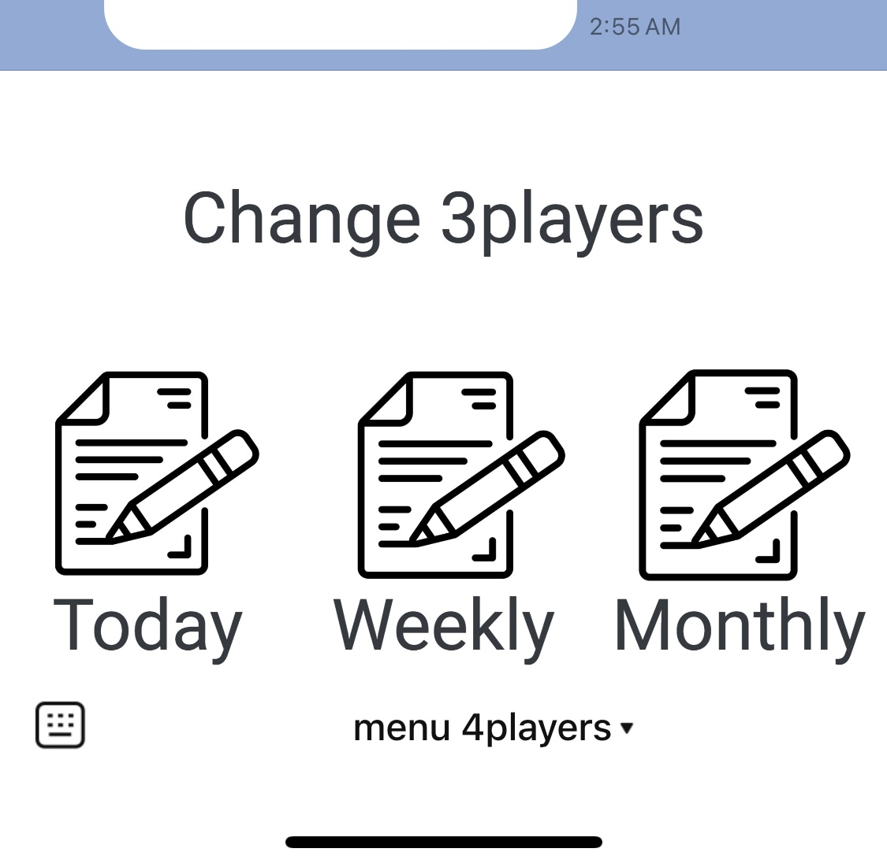

# How to use
## How to start
```
cd docker
docker-compose up
```

## endpoint

This project uses Swagger to provide interactive API documentation. You can view the API documentation in your browser by following these steps:

Make sure the server is running. You can start the server by running the following command:

Open your browser and navigate to:

```
http://localhost:8080/api-docs
```

## prerequisite
- For integrating with Google Sheets, please refer to this [repository](https://github.com/tomoki-yamamura/mahjong-score).

- For integrating with LINE, please refer to this [repository](https://github.com/tomoki-yamamura/line-richmenu).

## LINE integration
If you succesfully integrate with LINE, you can receive webhook from LINE and you reply a score automatically.


